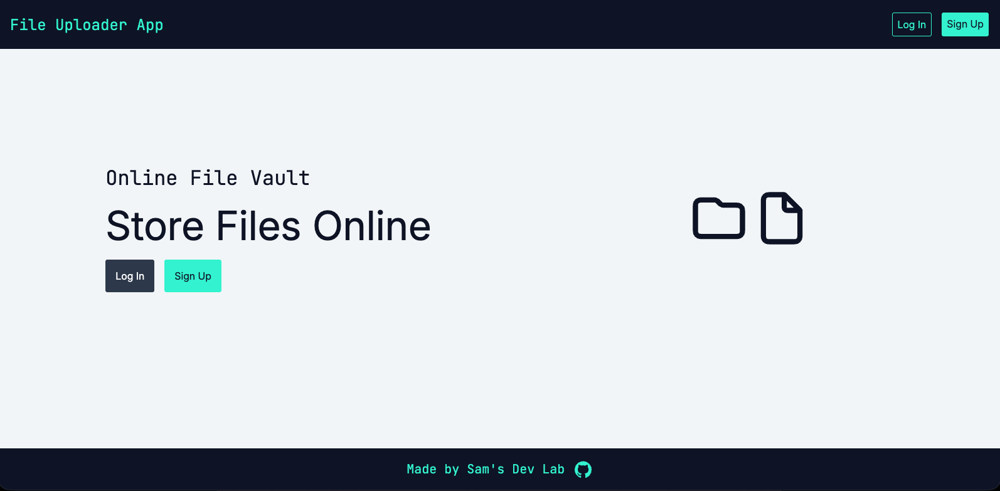
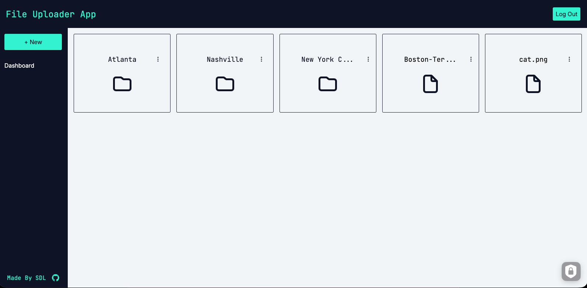
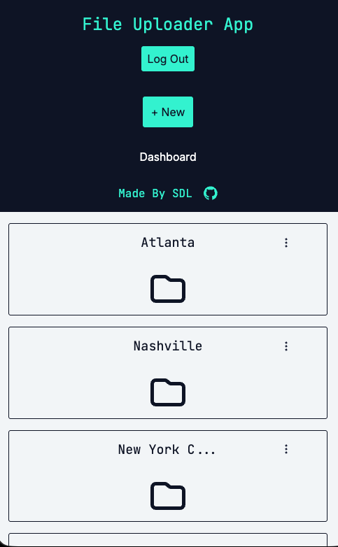

# 📂 File Uploader

A stripped-down, mock Google Drive application built with Node.js, Express, PostgreSQL, EJS, Prisma, and Supabase.

This project was created to deepen my understanding of the Prisma ORM and relational database design while learning how to integrate cloud file storage with Supabase.

## 🚀 Live Deployment

https://file-uploader-fn86.onrender.com

## 👓 Overview

File Uploader allows authenticated users to upload files to a personal dashboard or organize them into folders. Users can create, rename, and delete folders, as well as view, download, rename, and delete uploaded files.

## 👨‍💻 Technologies Used

- Node.js
- Express
- PostgreSQL
- Prisma
- EJS
- HTML
- CSS
- JavaScript
- express-validator
- node-postgres
- multer
- Supabase

## ✨ Features

- User authentication and session management
- Create, read, update, and delete folders
- Upload, view, rename, download, and delete files
- Cloud file storage with Supabase
- File type and size restrictions
- Responsive design

## 👨‍🎓 What I Learned

- Designing relational database schemas with Prisma ORM
- Querying PostgreSQL databases with Prisma
- Managing authentication and user sessions
- Handling multipart file uploads with Multer
- Uploading files to Supabase Storage
- Applying file MIME type and size restrictions
- Connecting a Node.js/Express application to cloud services

## 🛠️ Future Improvements

- Display accepted file types and size limits before uploading
- Add an upload progress indicator
- Add shared folder functionality
- Add subfolder support and nested directory routing
- Add file search and filtering

## 📺 Screenshots

### Landing Page

### Dashboard

### Mobile

